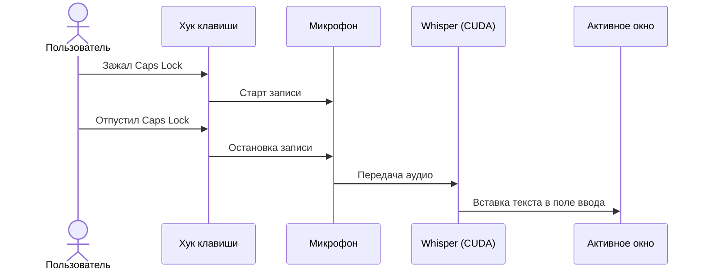

<div align="center">

# 🎙️ OhMyVoice

**Быстрый и приватный голосовой ввод для Windows на Go и Whisper (CUDA).**

[](https://golang.org)
[](https://microsoft.com/windows)
[](https://developer.nvidia.com/cuda-toolkit)
[](https://learn.microsoft.com/en-us/windows/win32/gdi/windows-gdi)
[](https://github.com/TRANSCRYPTOR-progr/ohmyvoice)
[](LICENSE)

*Зажали клавишу — надиктовали текст — отпустили — готовый текст уже в активном окне.*

</div>

---

### Как и зачем это появилось

Мне в какой-то момент надоело набирать длинные сообщения руками, и захотелось нормальный голосовой ввод: зажал кнопку, спокойно проговорил мысль, отпустил — и текст уже напечатан (в Telegram, VS Code, браузере или где угодно).

Искать готовые решения в интернете, сравнивать комбайны с подписками, регистрациями, облаками и тоннами лишнего функционала было откровенно лень. Поэтому я сел вечером, открыл диалог с нейросетью и за один вечер собрал эту утилиту под себя.

Получилась простая и быстрая штука: работает полностью локально на видеокарте, звук никуда в сеть не отправляет, память не жрёт и делает ровно то, что нужно. Решил выложить в опенсорс — вдруг кому-то тоже сэкономит время и пальцы.

---

## Что умеет

- **Push-to-Talk (по умолчанию `Caps Lock`)**: Зажали кнопку — идёт запись, отпустили — текст сразу печатается в активное поле ввода. При этом короткое нажатие на `Caps Lock` по-прежнему переключает регистр, как обычно.
- **Работает локально и быстро**: Распознавание идёт на вашей видеокарте NVIDIA (CUDA 12.4) через `whisper.cpp`. Обработка короткой фразы занимает ~200–500 мс. Никаких внешних серверов и интернета не требуется.
- **Ненавязчивый индикатор (HUD)**: Небольшой статус-виджет показывает состояние записи и распознавания, не перехватывая фокус у рабочего окна.
- **Окно настроек**: Можно выбрать модель Whisper (`base`, `small`, `medium`), язык распознавания, горячую клавишу, звук и автозагрузку.
- **Звуковой отклик**: Негромкие щелчки при начале и окончании записи (как в Discord Push-to-Talk), чтобы на слух понимать, что микрофон активен.
- **Голосовая команда**: Если надиктовать слово «настройки» или «параметры», утилита сама откроет окно конфигурации.

---

## Как это устроено



---

## Быстрый старт

### 1. Клонирование
```powershell
git clone https://github.com/TRANSCRYPTOR-progr/ohmyvoice.git
cd ohmyvoice
```

### 2. Загрузка модели Whisper
Для большинства задач оптимальна модель `small` (~480 МБ):

```powershell
# Рекомендуемая модель (баланс скорости и качества):
powershell -ExecutionPolicy Bypass -File .\setup_models.ps1 -Model small

# Или более точная модель Medium (~1.5 ГБ):
powershell -ExecutionPolicy Bypass -File .\setup_models.ps1 -Model medium
```

### 3. Бинарники whisper.cpp и CUDA
Скрипт загрузит скомпилированный `whisper-cli` с поддержкой CUDA 12.4 и распакует нужные DLL в папку `bin/`:

```powershell
powershell -ExecutionPolicy Bypass -File .\setup_cuda_binaries.ps1
```

### 4. Запуск
Запустите `ohmyvoice.exe`. Приложение свернётся в фоновый режим и будет реагировать на зажатие выбранной горячей клавиши.

---

## Настройка

Открыть окно настроек можно тремя способами:
1. Сказать в микрофон: **«настройки»** или **«параметры»**.
2. Нажать **правой кнопкой мыши** по плавающему индикатору записи.
3. Запустить команду: `ohmyvoice.exe --settings`.

Параметры сохраняются в `config.json`, при желании файл можно править вручную:

```json
{
  "model": "ggml-small.bin",
  "language": "ru",
  "threads": 6,
  "sound_feedback": true,
  "autostart": true,
  "hotkey": "caps_lock"
}
```

| Параметр | Значения | Описание |
| :--- | :--- | :--- |
| `model` | `ggml-base.bin`, `ggml-small.bin`, `ggml-medium.bin` | Модель Whisper |
| `language` | `ru`, `en`, `auto` | Язык распознавания речи |
| `threads` | Число (например, `6`) | Количество потоков CPU |
| `sound_feedback` | `true`, `false` | Звуковые сигналы при записи |
| `autostart` | `true`, `false` | Запуск вместе с Windows |
| `hotkey` | `caps_lock`, `right_ctrl`, `scroll_lock`, `f8`, `right_alt` | Клавиша Push-to-Talk |

---

## Сборка из исходников

Для сборки потребуется Go 1.22+:

```powershell
# Оконная сборка без всплывающей консоли:
go build -ldflags="-H=windowsgui" -o ohmyvoice.exe .

# Консольная сборка (для отладки и просмотра логов):
go build -o ohmyvoice.exe .
```

---

## Требования

- Windows 10 / 11 (64-bit).
- Видеокарта NVIDIA с поддержкой CUDA (для быстрого инференса).
- Микрофон.

---

## Лицензия

[MIT](LICENSE)
