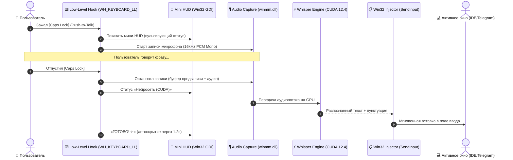

<div align="center">

# 🎙️ OhMyVoice

**Быстрый, приватный и ультралегковесный голосовой ввод для Windows на Go и Whisper CUDA.**

[](https://golang.org)
[](https://microsoft.com/windows)
[](https://developer.nvidia.com/cuda-toolkit)
[](https://learn.microsoft.com/en-us/windows/win32/gdi/windows-gdi)
[](https://github.com/TRANSCRYPTOR-progr/ohmyvoice)
[](LICENSE)

*Никаких облаков, абонентских плат, Electron и задержек. Диктуйте мысли прямо в Telegram, VS Code, браузер, Discord, заметки или терминал.*

</div>

---

## ⚡ О проекте

**OhMyVoice** превращает вашу видеокарту NVIDIA в персонального скоростного стенографиста. Вы зажимаете клавишу (по умолчанию `Caps Lock`), проговариваете фразу в обычном темпе — отпускаете клавишу, и расшифрованный текст с расставленной пунктуацией мгновенно печатается в активное окно.

Вся нейросетевая обработка происходит **100% локально на вашем ПК** благодаря аппаратному ускорению CUDA 12.4. Задержка от момента отпускания клавиши до появления готового текста — всего **~200–500 мс**.

---

## 🛠️ Архитектура работы



---

## 🌟 Ключевые возможности

- ⚡ **CUDA 12.4 Аппаратное ускорение**:
  Транскрибация нейросетью Whisper выполняется непосредственно на тензорных и CUDA-ядрах вашей видеокарты NVIDIA (GTX 10xx, RTX 20xx/30xx/40xx). Время инференса фразы составляет ~200–500 мс вместо 4–6 секунд на процессоре.
- 🖤 **Скрытный Mini HUD и OLED Black Settings**:
  Абсолютный черный фон (`#000000`), плавное скругление углов, двойная буферизация GDI (без моргания) и флаг `WS_EX_NOACTIVATE` — виджет никогда не ворует фокус у рабочего окна и появляется только в момент диктовки.
- 🎙️ **Умный Push-to-Talk без потери функций**:
  Используется низкоуровневый хук Windows (`WH_KEYBOARD_LL`). Одиночный короткий клик по `[Caps Lock]` по-прежнему привычно переключает регистр клавиатуры. При зажатии — активируется диктовка.
- 🎛️ **Самописные кастомные контролы**:
  Никаких устаревших стандартных оконных контролов Windows 95:
  - Плавные iOS-style переключатели (Toggle Switches).
  - Сегментированные чип-пикеры клавиш и языков.
  - Интерактивные карточки моделей Whisper (`Base`, `Small`, `Medium`).
- 🔔 **Звуковой фидбек Discord PTT**:
  Приятные тактильные звуковые сигналы при начале записи, окончании и вставке текста. Звуки загружаются напрямую в RAM и воспроизводятся с нулевой задержкой.
- 🚀 **Нативная автозагрузка Windows**:
  Управление автозагрузкой через ветку реестра `HKCU\Software\Microsoft\Windows\CurrentVersion\Run`. Приложение бесшумно стартует в фоне вместе с системой.
- 🛡️ **Полная приватность**:
  Звук с вашего микрофона физически не может покинуть компьютер — в коде нет ни единого сетевого запроса к сторонним API.

---

## 🚀 Быстрый старт

### 1. Клонирование репозитория
```powershell
git clone https://github.com/TRANSCRYPTOR-progr/ohmyvoice.git
cd ohmyvoice
```

### 2. Загрузка моделей Whisper
Запустите встроенный скрипт загрузки (по умолчанию скачивается рекомендуемая модель `small`):
```powershell
# Скачать сбалансированную модель Small (~480 МБ):
powershell -ExecutionPolicy Bypass -File .\setup_models.ps1 -Model small

# Или скачать флагманскую модель Medium (~1.5 ГБ):
powershell -ExecutionPolicy Bypass -File .\setup_models.ps1 -Model medium

# Или скачать все модели сразу:
powershell -ExecutionPolicy Bypass -File .\setup_models.ps1 -Model all
```

### 3. Бинарные зависимости CUDA
Для работы GPU-ускорения в папку `bin/` помещаются:
- `whisper-cli.exe` (скомпилированный с поддержкой CUDA)
- `ggml-cuda.dll`, `ggml-base.dll`, `ggml-cpu.dll`
- Библиотеки рантайма CUDA: `cublas64_12.dll`, `cublasLt64_12.dll`, `cudart64_12.dll`

---

## ⚙️ Конфигурация (`config.json`)

Параметры сохраняются автоматически через окно настроек или редактируются вручную в `config.json`:

```json
{
  "model": "ggml-medium.bin",
  "language": "ru",
  "threads": 6,
  "sound_feedback": true,
  "autostart": true,
  "hotkey": "caps_lock"
}
```

| Параметр | Возможные значения | Описание |
| :--- | :--- | :--- |
| `model` | `ggml-base.bin`, `ggml-small.bin`, `ggml-medium.bin` | Модель Whisper (Скорость vs Точность) |
| `language` | `ru`, `en`, `auto` | Язык распознавания речи |
| `threads` | Число (напр. `6`) | Количество потоков CPU |
| `sound_feedback` | `true`, `false` | Звуковые эффекты PTT при записи |
| `autostart` | `true`, `false` | Запуск при включении Windows |
| `hotkey` | `caps_lock`, `right_ctrl`, `scroll_lock`, `f8`, `right_alt` | Клавиша Push-to-Talk |

---

## 🗣️ Голосовые команды и управление

- **Открыть настройки голосом**: Зажмите клавишу диктовки и скажите: **«Открой настройки»** или **«Параметры»**.
- **Открыть настройки мышью**: Кликните **правой кнопкой мыши** по плавающему виджету HUD.
- **Открыть настройки через CLI / Ярлык**: `ohmyvoice.exe --settings`.
- **Быстрый выход из настроек**: Клавиша `Esc` или клик по кнопке `✕`.

---

## 🔨 Сборка из исходников

Для сборки требуется Go 1.22+:

```powershell
# Сборка нативного оконного приложения (без всплывающего черного окна консоли):
go build -ldflags="-H=windowsgui" -o ohmyvoice.exe .

# Или стандартная консольная сборка для отладки:
go build -o ohmyvoice.exe .
```

---

## 📄 Лицензия

Проект распространяется под открытой лицензией [MIT](LICENSE).
Разработано с душой для максимальной продуктивности.
